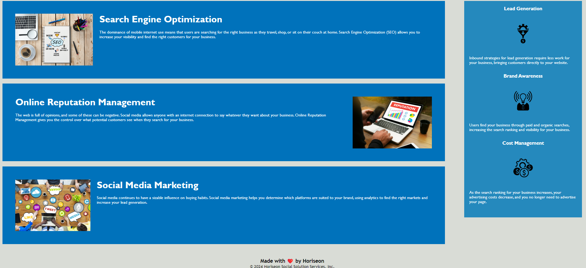

# Horiseon.refactoring

## Description

Horiseon website was a prebuilt structure that needed to be refined in its html/CSS code and the addition of alt attributes to make a webage that is accessible. The html code was refined to be easier to read by adding semantic language. CSS code was refined to minimize the repetitive usage of id's.

[GitHub Repo](https://github.com/cnm724/Horiseon.refactoring)-https://github.com/cnm724/Horiseon.refactoring

[GitPages](https://cnm724.github.io/Horiseon.Challenge1/)-https://cnm724.github.io/Horiseon.Challenge1/

## Usage

## Credits

https://www.semrush.com/blog/semantic-html5-guide/
-used for semantic HTML aid

## License

MIT License
